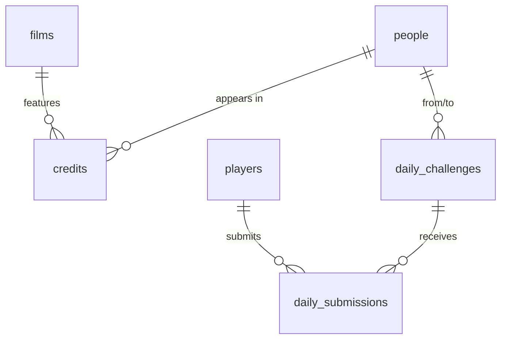

# castlink — Architecture & Implementation Plan

Status: **approved** (planning pass, Aug 2026). Phases are approved individually before work starts.

## Context

`castlink` is a "six degrees of separation" game for film: given two actors, players find the shortest
chain of shared films connecting them. It adds a daily challenge with deterministic actor pairs, a
live leaderboard, and a trivia mode built from the same dataset.

This is a portfolio project intended to hold up under technical-interview scrutiny, so the plan
optimises for defensible architectural choices and testable core logic over shipping speed.

**Prerequisite:** .NET 8 SDK.

**Decisions locked in during planning:**

| Decision | Choice |
|---|---|
| Graph scope | ~30k films / ~120k actors (`vote_count >= 200`, top ~15 billed cast per film) |
| Path engine | In-memory CSR graph + bidirectional BFS |
| Player identity | Anonymous, signed player token + display name |
| Blazor hosting | ASP.NET Core hosted (API serves WASM assets) |

---

## Resolved: what Redis is actually for

The original brief listed Redis for "hot shortest-path queries and daily challenge state". Once the
graph is resident in memory, a bidirectional BFS completes in **microseconds** — a Redis round-trip is
roughly an order of magnitude *slower* than just recomputing the answer. Caching paths would be
cargo-cult caching, and an interviewer will probe it.

Redis stays in the stack, scoped to the jobs where it genuinely earns its place:

- **SignalR backplane** — required the moment the API runs more than one instance.
- **Leaderboard sorted set** (`ZADD`/`ZRANGE`) — the right data structure for live rankings, avoids
  hammering Postgres on every submission.
- **Distributed cache** for daily-challenge metadata and per-player rate limiting.

Path results are **not** cached. Being able to explain that deliberate non-use is worth more than a
cache layer that does nothing.

---

## 1. Project structure

```
castlink.sln
docker-compose.yml            # postgres + redis for local dev
src/
  Castlink.Domain/            # entities, value objects. Zero external deps.
  Castlink.Application/       # use cases, port interfaces, BFS algorithm, scoring. Depends: Domain.
  Castlink.Infrastructure/    # EF Core + Npgsql, Redis, TMDB HTTP client, graph loader.
  Castlink.Ingestion/         # worker host for TMDB sync. Runnable standalone or as hosted service.
  Castlink.Api/               # controllers, SignalR hubs, DI composition root. Serves the WASM client.
  Castlink.Client/            # Blazor WebAssembly.
  Castlink.Shared/            # DTOs shared by Api + Client. NO EF Core.
tests/
  Castlink.Application.Tests/     # BFS, scoring, challenge determinism. Pure, fast, no I/O.
  Castlink.Infrastructure.Tests/  # ingestion idempotency, TMDB client. Testcontainers.
  Castlink.Api.Tests/             # endpoint integration via WebApplicationFactory.
```

**Dependency rule:** `Domain <- Application <- Infrastructure <- Api`. `Application` defines
interfaces (`IPersonRepository`, `ITmdbClient`, `IGraphSnapshot`); `Infrastructure` implements them.
The BFS lives in `Application` with no infrastructure dependency, so it unit-tests against
hand-built graph fixtures with no database.

**`Castlink.Shared` is load-bearing and easy to get wrong.** It is referenced by the Blazor WASM
client, so it must not transitively pull in EF Core, Npgsql, or anything server-only — that bloats
the download and breaks trimming. Keep it to plain DTOs and enums.

---

## 2. Data model

Postgres via EF Core, migrations checked in.



**`people`** — `id` (PK, = TMDB person id), `name`, `popularity`, `profile_path`,
`known_for_department`, `credit_count` (denormalised, for challenge-pool filtering),
`last_synced_at`.

**`films`** — `id` (PK, = TMDB movie id), `title`, `release_year`, `popularity`, `vote_count`,
`poster_path`, `last_synced_at`.

**`credits`** — `film_id`, `person_id` (composite PK), `billing_order`, `character`.
Indexes on **both** `(person_id)` and `(film_id)` — the bipartite traversal needs both directions.

**`daily_challenges`** — `date` (PK), `from_person_id`, `to_person_id`, `optimal_length`,
`canonical_path` (jsonb), `generated_at`.

**`players`** — `id` (uuid PK), `display_name`, `created_at`.

**`daily_submissions`** — `id`, `date`, `player_id`, `path` (jsonb), `path_length`, `score`,
`duration_ms`, `submitted_at`. Unique index on `(date, player_id)`.

**`ingestion_runs`** — `id`, `started_at`, `completed_at`, `status`, `films_processed`,
`people_processed`, `error`. Operational visibility.

**`sync_state`** — `key`, `value`, `updated_at`. Holds the TMDB changes-API watermark.

### Three modelling choices worth defending

1. **TMDB IDs as primary keys.** Natural keys make upserts idempotent for free and make debugging
   against TMDB trivial. The cost is coupling the schema to an external system — if TMDB ever recycles
   an id, we inherit the mess. Acceptable here; the alternative (surrogate key + unique `tmdb_id`) buys
   little for a read-mostly mirror.

2. **Table is `people`, not `actors`.** Trivia mode will eventually want directors, and
   `/movie/{id}/credits` already returns crew in the same response. Naming it `people` now avoids a
   painful rename later. v1 only ingests the `cast` array; the graph only ever traverses cast credits.

3. **No materialised actor↔actor edge table.** A 15-cast film generates C(15,2) = 105 edges;
   30k films would be ~3M rows of derived data to keep consistent. Traversing the bipartite
   person→film→person graph gives identical results with no denormalisation to maintain.

`pg_trgm` extension + GIN index on `people.name` for fuzzy actor search.

---

## 3. API surface

All under `/api`, JSON, `Castlink.Shared` DTOs.

| Method | Route | Notes |
|---|---|---|
| `GET` | `/api/people/search?q=&limit=` | Trigram search. Returns `id, name, profilePath, popularity`. |
| `GET` | `/api/people/{id}` | Detail + notable films. |
| `GET` | `/api/people/{id}/films` | Filmography, paged. |
| `POST` | `/api/path` | `{fromPersonId, toPersonId}` → `{degrees, links[], computedInMs}`. Each link: `{fromPerson, film, toPerson}`. `404` if no path within depth cap. |
| `GET` | `/api/daily` | Today's challenge. **Never includes `optimalLength` or the path.** |
| `POST` | `/api/daily/submit` | `{path: [{personId, filmId}...], durationMs}` → validated + scored. |
| `GET` | `/api/daily/{date}/leaderboard?top=` | Ranked entries from the Redis sorted set. |
| `POST` | `/api/players` | Issues signed player token + display name. |
| `GET` | `/api/trivia/question` | Generated question + 4 options. |
| `POST` | `/api/trivia/answer` | `{questionId, optionId}` → correct/incorrect + explanation. |

**SignalR hub** at `/hubs/leaderboard`. Client calls `JoinDaily(date)` to enter a group; server pushes
`LeaderboardUpdated(entries)` on each accepted submission.

### Two rules the implementation must not violate

- **`GET /api/daily` must not leak the answer.** Optimal length and canonical path are revealed only
  in the `POST /api/daily/submit` response. It is very easy to leak this by returning the full entity.
- **Submitted paths are validated server-side against `credits`.** For every consecutive step, assert
  that both people actually hold a credit on the claimed film. Never trust a client-reported length.

---

## 4. TMDB constraints to design around

Verified against TMDB docs and community threads (Aug 2026).

**Rate limits.** The old 40-req/10s limit was disabled in Dec 2019. What remains is CDN-level:
**~50 requests/second and 20 concurrent connections, enforced per IP** — the API key is not
considered. No daily cap. Design: token bucket via `System.Threading.RateLimiting` at a conservative
**25 req/s**, max **8 concurrent connections**, plus Polly with jittered exponential backoff on
429/5xx. Since limiting is per-IP, running ingestion from two machines behind one NAT will collide.

**Daily ID exports are the right seed, not `/discover`.**
`files.tmdb.org/p/exports/movie_ids_MM_DD_YYYY.json.gz` publishes every valid id daily (job runs
~07:00 UTC, available by 08:00 UTC, retained 90 days). Files are newline-delimited JSON objects,
*not* a JSON array — parse line by line. Each line carries `popularity`, which lets us filter the
candidate set **before** spending any API calls. `/discover` is capped at 500 pages / 10k results and
cannot enumerate the catalogue.

**`append_to_response` halves the request count.** `/movie/{id}?append_to_response=credits` returns
detail and full cast in one call instead of two. At 30k films that is 30k requests instead of 60k.

**`/movie/changes` for incremental sync.** Returns ids changed in the last 24h by default, up to 14
days, 100 per page. This is what makes re-runs cheap after the initial backfill.

**Licensing — read before deploying anywhere public.**
- Attribution is mandatory and the wording is specified: *"This product uses the TMDB API but is not
  endorsed or certified by TMDB."* It must appear in an About/Credits section, with the TMDB logo.
- The free licence is **non-commercial only**. Selling, leasing, sublicensing, or deriving revenue
  requires a written commercial agreement with TMDB. A portfolio project is fine; monetising it later
  is not, without that agreement.
- Caching a local mirror is expected usage — that is what the export files exist for.

Attribution ships in **Phase 3**, not deferred to the end.

---

## 5. Phased implementation plan

Each phase ends at a reviewable checkpoint. Tests are written within the phase that introduces the
logic — not batched at the end.

### Phase 0 — Foundation
Solution skeleton with the project graph above. `docker-compose.yml` (Postgres 16 + Redis 7).
`.gitignore`, `.editorconfig`, `Directory.Build.props` with `TreatWarningsAsErrors` and nullable
enabled. GitHub Actions CI: restore, build, test. Config via `IOptions<TmdbOptions>`, key read from
**user secrets locally / env vars in Azure** — never committed, with a CI check to keep it that way.

*Checkpoint: `dotnet build` and an empty `dotnet test` pass in CI.*

### Phase 1 — Data model + ingestion
EF Core entities, migrations, `CastlinkDbContext`. TMDB client with the throttle + retry policy.
Ingestion pipeline: download daily export → filter by `popularity`/`vote_count` → fetch
detail+credits → `COPY` into unlogged staging tables → single `INSERT ... ON CONFLICT DO UPDATE`
merge per table inside one transaction. Incremental path via `/movie/changes` + `sync_state`
watermark.

Bulk-merge via staging is the point here — `SaveChanges()` in a loop over ~1M credits would take hours.

*Tests:* TMDB response parsing against recorded fixtures; throttle honours its budget; **idempotency —
run the same ingest twice against a Testcontainers Postgres and assert identical row counts with
`last_synced_at` advanced.*

*Checkpoint: populated database, re-runnable without duplicates.*

### Phase 2 — Shortest path
Load credits into a CSR (compressed sparse row) snapshot at startup: `personOffsets` (`int[N+1]`),
`personToFilms` (`int[E]`), `filmOffsets`, `filmToPeople`, plus dense-index ↔ TMDB-id dictionaries.
At ~1M credits that is roughly 8 MB of `int[]` per direction — trivially resident.

Bidirectional BFS alternating frontiers from both endpoints, meeting in the middle. Unidirectional
BFS is not viable: a popular actor has thousands of co-stars, so the depth-3 frontier explodes into
the millions. Meeting at depth ~2 from each side keeps it tractable — this is the core algorithmic
story of the project.

Also handle: same actor for both endpoints, no path (disconnected components), depth cap of 6
degrees, and a **deterministic tie-break** among equal-length paths (prefer higher `vote_count`, then
lower film id) so the daily challenge's "optimal" answer is stable.

*Tests:* hand-built fixture graphs — direct co-star, 2/3-hop chains, disconnected pair, self-pair,
depth-cap boundary, tie-break determinism. All pure, no database.

*Checkpoint: `POST /api/path` returns correct chains; algorithm suite green.*

### Phase 3 — Blazor UI
Actor search (debounced typeahead), pair selection, path result display with posters, free-play mode.
TMDB attribution + logo in the footer and About page. Deliberately plain styling.

*Checkpoint: playable free mode end to end.*

### Phase 4 — Daily challenge + live leaderboard
Deterministic generation: `SHA256(date + salt)` seeds a PRNG that picks a pair from a curated pool
(people with `credit_count >= 8` above a popularity floor, so both actors are recognisable); accept
only if `2 <= optimal <= 4`, else advance the seed. **The generated row persists `optimal_length` and
`canonical_path`** — otherwise a re-ingest could silently change the answer to a challenge players
have already submitted against.

Server-side path validation, scoring (base 1000, penalty per degree over optimal, 0 for invalid,
`duration_ms` as tie-break), Redis sorted set for rankings, SignalR push on each accepted submission.
Anonymous player tokens (signed, localStorage).

*Tests:* same date → same challenge across runs; scoring boundaries; validation rejects fabricated
paths (non-existent credit, non-contiguous chain, wrong endpoints).

*Checkpoint: live leaderboard updates across two browser windows.*

### Phase 5 — Trivia
Two question templates for v1: *"Which of these actors appeared in {film}?"* and *"Which film connects
{A} and {B}?"*, distractors drawn from the same dataset with a correctness check so no distractor is
accidentally a valid answer. Optional crew ingestion to unlock director questions.

*Checkpoint: trivia playable; distractor-validity tests green.*

---

## Blazor notes (first Blazor project)

- **WASM runs entirely in the browser.** Anything in `Castlink.Client` is public — no secrets, no
  authoritative scoring. Every rule that matters is enforced in `Castlink.Api`.
- **Hosted model:** `Castlink.Api` serves the client's static assets, so there is no CORS setup and
  SignalR is same-origin. One Azure App Service.
- `@inject HttpClient` is preconfigured with the app base address; call the API with relative paths.
- **Trimming will bite.** WASM publish trims aggressively and can strip types only used via
  reflective JSON deserialisation. Use `System.Text.Json` source-generated contexts for the
  `Castlink.Shared` DTOs — this is the most common first-Blazor-project production bug.
- SignalR: `HubConnectionBuilder` with `WithAutomaticReconnect()`; dispose connections via
  `IAsyncDisposable` or they leak across navigations.
- First load pulls several MB of runtime; enable Brotli compression on the host.

---

## Verification

- **Algorithm:** `dotnet test tests/Castlink.Application.Tests` — fixture graphs, no I/O, sub-second.
- **Ingestion idempotency:** Testcontainers Postgres, run the pipeline twice, assert row counts
  identical and `last_synced_at` advanced.
- **API:** `WebApplicationFactory` integration tests over Testcontainers Postgres + Redis, asserting
  in particular that `GET /api/daily` does not expose the optimal path.
- **Manual end-to-end:** `docker compose up`, run ingestion, `dotnet run` the API, play a round; open
  two browser windows on the daily challenge and confirm the leaderboard updates live in both.
- **CI:** GitHub Actions runs build + full test suite on every push.

---

## Open items

1. **Ingestion runtime.** ~30k films at 25 req/s is roughly 20 minutes of pure request time; with
   retries and merge, budget a few hours for the first backfill. Fine to run once locally and restore
   a dump to Azure rather than ingesting in the cloud.
2. **Azure cost.** Postgres Flexible Server (B1ms) + Azure Cache for Redis (Basic C0) + App Service
   (B1) is roughly $50–70/month. If that matters for a portfolio piece, Redis can be swapped for
   `IDistributedMemoryCache` in a single-instance deployment — at the cost of losing the SignalR
   backplane story.
3. **Crew ingestion** is deferred to Phase 5. If director-based trivia is wanted, Phase 1 should
   capture crew from the same API response rather than re-fetching 30k films later.
